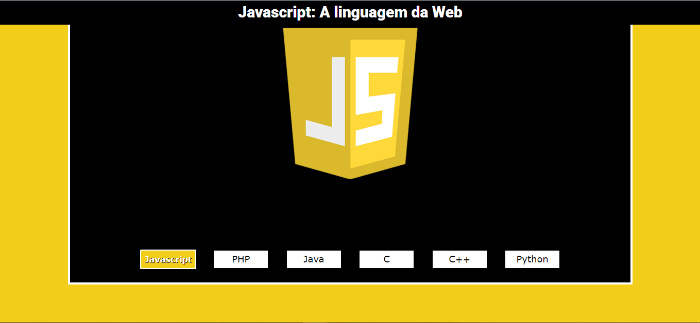

# LinguagensProgramacao
## [Acessar site]( https://matheusfeliperuiz.github.io/LinguagensProgramacao/)

## :memo: Descrição do Projeto

Projeto feito para interagir com a página e mostrar a página sendo personalizada, de acordo com a linguagem de programação escolhida.

##  Desenvolvido com: 

 <strong> HTML</strong>
 <strong>CSS</strong>
 <strong>SASS</strong>
 <strong>JavaScript</strong>
